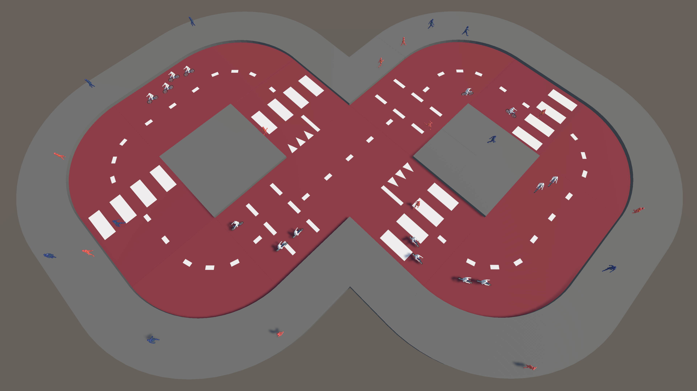

# The Cyclist

## Overview
**The Cyclist** is a crowd simulation project focused on modeling interactions between cyclists and pedestrians in an urban environment. Developed using Unity, this simulation leverages **NavMesh pathfinding** and **Reciprocal Velocity Obstacles (RVO)** for realistic movement and collision avoidance. 

The goal is to simulate real-life traffic behavior, particularly:
- **Collision avoidance** between pedestrians and cyclists
- **Priority control** at intersections and crosswalks
- **Realistic movement dynamics** using waypoints and behavior modeling

## Features
- **Top-down 3D simulation**
- **Dynamic pedestrian and bicycle movement**
- **Waypoint-based navigation system**
- **NavMesh with dual surfaces for pedestrians and cyclists**
- **Collision avoidance using RVO (Reciprocal Velocity Obstacles)**
- **Priority-based interaction at intersections and crosswalks**
- **Cyclists maintain right-side riding behavior**
- **Overtaking mechanism for cyclists**

## Contributors
This project was created at **Utrecht University** as an assignment for the **Crowd Simulation** course:
- **Matúš Bystrický**
- **Yang Cheng**
- **Alessandro Busacchi**
- **Arie Klaver**
- **Matthijs Berkhout**

## Watch the Simulation
🎥 [Demo Video](https://github.com/matus01/The_Cyclist/blob/main/assets/Video_Showing_Seperate_Features.mp4)
